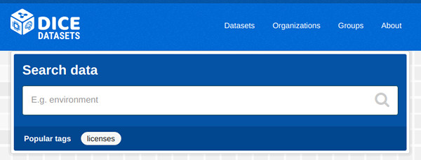

# DICE CKAN



## Installation using Docker

The following installation instructions are based on [Docs 2.9.2: Installing CKAN with Docker Compose](https://docs.ckan.org/en/2.9/maintaining/installing/install-from-docker-compose.html).
The  installation will run five Docker containers: CKAN, PostgreSQL, Redis, Solr and CKAN Datapusher.


### 1. Environment

The docker people used a cloud based VM with 16 GB storage. They mounted a 100 GB btrfs-formatted external storage volume and symlinked /var/lib/docker to the external volume.

Install *Docker* and *Docker Compose*.

Get the code:

```shell
git clone https://github.com/dice-group/dice-ckan.git
cd dice-ckan
git checkout dice-ckan-2.9.2
```


### 2. Build Docker images

Create the configuration file [.env](https://github.com/dice-group/dice-ckan/blob/dice-ckan-2.9.2/contrib/docker/.env.dice.template):

```shell
cp contrib/docker/.env.dice.template contrib/docker/.env
```

* The file contains entries to run CKAN on localhost. For a production setup, edit **CKAN_SITE_URL** and **CKAN_PORT**.
* You should also change the password entries **POSTGRES_PASSWORD** and **DATASTORE_READONLY_PASSWORD**.
* To enable CKAN to send mails, set the **CKAN_SMTP_*** entries.

Start Docker:

```shell
cd contrib/docker
docker-compose up -d --build
```

On first runs, the postgres container could need longer to initialize the database cluster than the ckan container will wait for. This time span depends heavily on available system resources. If the CKAN logs show problems connecting to the database, restart the ckan container a few times:

```shell
docker-compose restart ckan
docker ps | grep ckan
docker-compose logs -f ckan
```

There should be 5 containers running and 4 volumes. (Check the
[original docs](https://docs.ckan.org/en/2.9/maintaining/installing/install-from-docker-compose.html#build-docker-images)
for details.)  
Access your running instance at CKAN_SITE_URL (e.g. [localhost:5000](http://localhost:5000) or [datasets.dice-research.org:443](https://datasets.dice-research.org:443))


### 3. Datastore and datapusher

Execute the built-in setup script (this is a [fixed command](https://github.com/ckan/ckan/issues/5677#issuecomment-713279480), as from CKAN 2.9 onwards, the paster command has been replaced with the ckan command):

```shell
docker exec ckan /usr/local/bin/ckan -c /etc/ckan/production.ini datastore set-permissions | docker exec -i db psql -U ckan
```

Add **datastore datapusher** to **ckan.plugins** and  enable the datapusher option **ckan.datapusher.formats**:

```shell
docker exec -u 0 -it ckan bash # as root
apt-get update ; apt-get install nano
nano /etc/ckan/production.ini
```

```ini
ckan.plugins = [...] datastore datapusher
ckan.datapusher.formats = [...]
```

Check if the datastore API returns content, e.g. at
[localhost](http://localhost:5000/api/3/action/datastore_search?resource_id=_table_metadata) or
[datasets.dice-research.org](https://datasets.dice-research.org:443/api/3/action/datastore_search?resource_id=_table_metadata).


### 4. CKAN users

You will be asked if you want to create a new user and for the related password to set.

```shell
docker exec -it ckan /usr/local/bin/ckan -c /etc/ckan/production.ini user setpass default
docker exec -it ckan /usr/local/bin/ckan -c /etc/ckan/production.ini user add dice
```

## Configuration

Edit the configuration file ([docs](https://docs.ckan.org/en/2.9/maintaining/configuration.html#ckan-configuration-file)) via:

```shell
docker exec -it ckan nano /etc/ckan/production.ini
```

```ini
ckan.auth.user_delete_groups = false
ckan.auth.user_delete_organizations = false
[...]
ckan.auth.create_user_via_web = false
[...]
ckan.auth.public_user_details = false
[...]
ckan.site_title = DICE datasets
[...]
ckan.favicon = /base/images/dice-favicon.png
[...]
licenses_group_url = http://licenses.opendefinition.org/licenses/groups/ckan.json
[...]
ckan.locale_order = en de pt_BR ja it cs_CZ ca es fr el sv sr sr@latin no sk fi ru pl nl bg ko_KR hu sa sl lv

```

## Finalization

Additional configuration can be set afterwards in the Web interface. There are some [default settings](configuration.md).


## About this repository

This repository was forked from [ckan/ckan](https://github.com/ckan/ckan).

To be able to keep the repositories in sync, to provide this readme file and not to end up in merge conflicts, the additional branch [dice](https://github.com/dice-group/dice-ckan/tree/dice) was created and set as default branch.

When this repository was created, the latest CKAN version was [release 2.9.2](https://github.com/ckan/ckan/releases/tag/ckan-2.9.2) (commit 1b6d917). That version was used to create branch **[dice-ckan-2.9.2](https://github.com/dice-group/dice-ckan/tree/dice-ckan-2.9.2)**. You can compare the [changes](https://github.com/dice-group/dice-ckan/compare/ckan-2.9.2..dice-ckan-2.9.2).